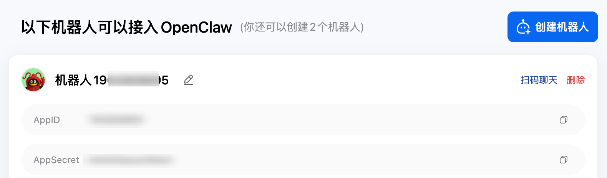
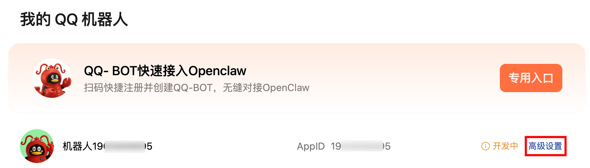
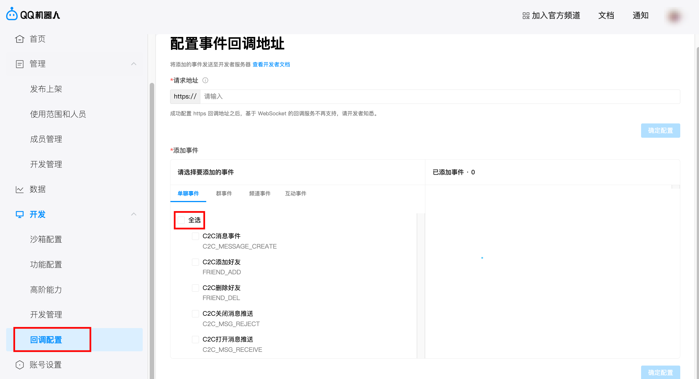

# CodexClaw

CodexClaw 是一个由 Codex 驱动的、基于 QQ 官方机器人平台的私人 AI 助理。不过它暂时更像是个从 QQ 控制 Codex 的遥控器，缺少长期记忆、自动 Skill 进化等机制。未来作者可能凭兴趣引入这些高级特性 : |

## 声明

本项目*<u>**完全以 Vibe Coding 方式完成**</u>*，现以“按现状提供”为原则开源或分发。作者、贡献者及相关第三方不对本项目的**可用性、正确性、安全性、适用性、持续维护状态**或与任何特定用途的兼容性作出任何明示或默示保证。

使用者应自行完成代码审查、环境隔离、权限控制、依赖审计、数据备份与上线验证，并自行判断本项目是否符合其所在地区、平台规则、组织制度及业务场景中的法律、合规、安全和运维要求。

本项目可能**调用外部服务、读写本地文件、处理聊天消息**、上传或下载附件，并可能因模型输出、配置错误、依赖缺陷、平台接口变化或操作失误导致服务中断、数据泄露、误操作、额外费用、账号处罚或其他直接、间接、附带、特殊、惩罚性损失。除法律强制规定外，作者与贡献者对此不承担责任。

在部署或使用本项目时，您**应妥善保管各类账号凭据、访问令牌、聊天数据与服务器权限，并自行承担由此产生的全部风险与后果**。若您不同意上述条件，请不要部署、复制、修改或使用本项目。

## 为什么你又整了个 Claw？

1. 我很讨厌 OpenClaw，它像个玩具，而且需要我电脑的完全访问权限；
2. 我很喜欢 Codex，它的任务交付能力相当可靠，而且沙箱安全机制也更完善；
3. Codex 订阅给的额度真的很多 👍；
4. 这个项目在蹭 OpenClaw 的热度 ; )

## 给人类看的部署说明

1. 在你想要部署 CodexClaw 的设备上配置好 Codex 的登陆凭据，确认 `codex exec --json` 可以正常运行；

2. 前往 [QQ 开放平台](https://q.qq.com/)，按要求完成登陆和个人认证等操作；

3. 在“首页”中，点击“机器人”，然后点击“创建 QQ 机器人”，获得的 AppID 和 AppSecret 记录下来备用；
    
4. 返回之前的首页，进入你新创建机器人的高级设置页面；
    

5. 下拉左侧栏，找到“回调配置”，在单聊事件中点击“全选”，保存；
    

6. 将第 3 步中获得的 AppID 和 AppSecret 填入下面的提示词中，发送给 Codex，它会帮你完成接下来的工作。注意，由于涉及到系统服务安装等行为，Codex **可能会请求执行一些提权命令，请谨慎检查这些命令的安全性，作者不对因此造成的损失承担任何责任**。如果不希望将密钥泄露给 Codex 的话，你也可以要求 Codex 引导你手工完成部署过程。

```plain
帮我在本机上部署 CodexClaw：https://github.com/Rhapsody0x1/CodexClaw ，我已经获取了你所需的 AppId: {} 和 AppSecret: {}。然后将其注册为系统服务，并为我提供管理其启用状态的命令。
```

7. CodexClaw 默认以允许网络访问的 workspace-write 沙盒模式启动 Codex，这能一定程度上保护你的设备安全。但由于各个平台的安全机制，沙盒可能导致 Codex 的一些能力无法正常发挥。目前作者观察到的问题：

    - 在 macOS 上由于 Seatbelt 机制无法正常使用 Playwright 操作浏览器；
    - 在 Linux 上因系统安全机制不能调用 apt 等系统级命令；

    如有条件，可以考虑在隔离的虚拟机/VPS 上以 danger-full-access 模式运行 Codex，这可以更好地发挥 Codex 的能力。至于如何修改配置，你可以询问万能的 Codex ; )

## 给 Codex 看的部署说明

1. 先检查基础环境，确认当前机器可联网，且已经安装 Rust 与 Codex CLI：

```bash
uname -a
whoami
pwd
rustc --version
cargo --version
codex --version
git --version
```

2. 如果缺少 Rust 工具链，则安装 Rust；如果缺少 `codex`，则先按当前官方方式安装，并要求用户完成登录。验收命令。若这一步失败，不要继续部署，先要求用户修复 Codex 运行环境与凭据问题。

```bash
codex exec --json "reply with exactly: ok"
```

3. 确认系统 Codex 目录 `~/.codex` 已存在，且至少包含 `config.toml` 与 `auth.json`。`codex-claw` 首次启动会将这些文件及 `skills/` 复制到 `~/.codex-claw/.codex/` 作为独立运行目录。

4. 使用用户目录部署（无需提权），例如：

```bash
mkdir -p ~/.codex-claw
cd ~/.codex-claw
git clone https://github.com/Rhapsdody0x1/CodexClaw.git repo
cd repo
```

若目录已存在仓库，则改为：

```bash
cd ~/.codex-claw/repo
git pull --ff-only
```

5. 创建运行配置文件，例如 `~/.codex-claw/codexclaw.toml`。将用户提供的 `AppID` 与 `AppSecret` 写入其中对应位置：

```toml
[general]
data_dir = "~/.codex-claw/data"
system_codex_home = "~/.codex"
codex_home_global = "~/.codex-claw/.codex"
default_workspace_dir = "~/.codex-claw/data/session/workspace"
codex_binary = "codex"
default_model = "gpt-5.4"
default_reasoning_effort = "medium"
self_repo_dir = "~/.codex-claw/repo"
self_build_command = "cargo build --release"
self_binary_path = "~/.codex-claw/repo/target/release/codex-claw"
launcher_control_addr = "127.0.0.1:8765"
enable_launcher = true

[qq]
app_id = "YOUR_APP_ID"
app_secret = "YOUR_APP_SECRET"
api_base_url = "https://api.sgroup.qq.com"
token_url = "https://bots.qq.com/app/getAppAccessToken"
```

6. 先做一次编译检查，再构建 release：

```bash
cd ~/.codex-claw/repo
cargo check
cargo build --release
```

7. 用前台方式先启动一次，确认程序能正常连上 QQ Gateway，且没有明显配置错误：

```bash
cd ~/.codex-claw/repo
CODEX_CLAW_CONFIG=~/.codex-claw/codexclaw.toml ./target/release/codex-claw
```

如果日志中出现 access token 获取失败、Gateway 连接失败或 Codex 启动失败，先停止并修复问题，再继续后续步骤。

8. 注册为“用户级自启服务”时，需要按系统环境灵活处理（如 macOS `launchd`、Linux 用户级 `systemd`、其他 init 系统）。核心要求：
- 工作目录指向 `~/.codex-claw/repo`
- 设置 `CODEX_CLAW_CONFIG=~/.codex-claw/codexclaw.toml`
- 启动命令为 `~/.codex-claw/repo/target/release/codex-claw`
- 使用当前登录用户运行，不要求 root

9. 启用并启动服务（命令因系统而异）。

10. 最后提醒从 QQ 客户端发送一条普通私聊消息进行联调，并检查服务日志。

## 命令列表

如果想要享受 QQ 官方机器人提供的快捷命令，可手动将下面的命令添加到命令列表。当然不添加也不影响它们的正常使用。

- `/help`：查看命令列表；
- `/model [name|inherit|status]`：设置或查看当前模型；
- `/fast [on|off|inherit|status]`：设置 Fast 模式；
- `/context [1m|standard|inherit|status]`：设置上下文模式；
- `/reasoning [low|medium|high|xhigh|inherit|status]`：设置思考深度；
- `/verbose [on|off|status]`：切换工具输出的简略或详细模式；
- `/plan [on|off|status]`：切换计划模式；
- `/status`：查看当前会话状态；
- `/sessions [all]`：先查看项目（按目录）列表；
- `/sessions <项目编号> [page]`：查看该项目下的会话列表；
- `/import`：查看系统 `~/.codex/sessions` 中可导入的项目；
- `/import <项目编号> [page]`：查看该项目下可导入会话；
- `/import <编号|会话ID>`：导入系统会话到 `~/.codex-claw/.codex/sessions`；
- `/resume <编号|会话ID>`：把磁盘会话恢复到前台；
- `/loadbg <编号|会话ID> [alias]`：把磁盘会话加载到后台；
- `/bg [alias]`：把当前前台会话转入后台；
- `/fg <alias>`：把后台会话切回前台；
- `/rename <old_alias> <new_alias>`：重命名后台会话标签；
- `/save`：显式保存当前前台会话；
- `/new [工作目录]`：将前台（若有内容）转后台并新建临时前台；可选指定工作目录，支持绝对路径，相对路径默认按当前前台工作目录解析；
- `/stop`：结束当前前台会话（已保存则保留，未保存则丢弃）并新建临时前台；
- `/interrupt`：仅停止当前运行，不结束会话；
- `/self-update`：触发重部署。若启用 launcher 则走热切换；否则覆盖当前运行二进制并退出，由守护服务自动拉起。

## 运行时文件

- 收到的图片和文件会下载到 `data/session/workspace/inbox/`。
- 每用户前后台会话状态会持久化到 `data/session/state.json`。
- CodexClaw 运行使用独立目录 `~/.codex-claw/.codex/`，其 `sessions/`、`skills/`、`config.toml` 与系统 `~/.codex` 分离。
- 首次启动会从系统 `~/.codex` 复制 `config.toml`、`auth.json`、`skills/` 到 `~/.codex-claw/.codex/`（已存在文件不覆盖）。
- 仓库内置 `codex-claw-update` Skill 位于 `.agents/skills/codex-claw-update/SKILL.md`，仅在该仓库上下文中生效。
- 会话采用统一运行语义；恢复会话优先按会话元数据继承配置，不足项回退到 `config.toml` 默认值。
- `/import` 可将系统 `~/.codex/sessions` 中的历史会话导入到 `~/.codex-claw/.codex/sessions/`。
- 新建临时前台会话默认工作目录位于 `~/.codex-claw/data/session/workspace/`；若执行 `/new <工作目录>`，则前台直接切到指定目录并在需要时自动创建该目录。
- 自动构建状态会写入 `data/self-update/last-build.json`。

## 贡献指南

本项目主要围绕作者的个人需求与兴趣演进。如果你有新的想法或使用场景，欢迎在 Discussion 中交流；如果你发现了明确的 Bug 或兼容性问题，也欢迎提交 Issue。对于功能建议，作者不保证一定会采纳、排期或长期维护。

若你的需求较为个性化，或与当前路线不完全一致，你可以直接 fork 本仓库，并在其基础上继续定制。
